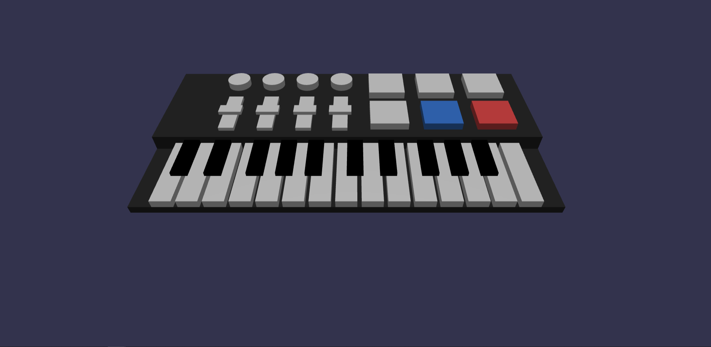

# AC1 - Computação Gráfica

Esse projeto foi feito em React utilizando o Babylon para renderizar os elementos 3D, além disso, foi utilizado outras bibliotecas para reproduzir som e para gerenciar o estado da aplicação.

## Resultado

Você pode clicar nas teclas para tocar música ou pode também clicar nos "pad" coloridos para tocar uma sequência padrão.

